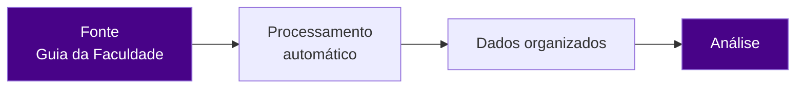

# Quali Acad

**Análise de qualidade acadêmica de cursos de ensino superior, com processamento automático de dados.**

---

## Quem somos

A Quali Acad é a organização do Learning Lab Ânima dedicada à análise de qualidade acadêmica de cursos de ensino superior.

Transformamos dados públicos do Guia da Faculdade em informação organizada, por meio de rotinas automáticas de consumo e processamento, sem digitação manual.

## O que fazemos

| | |
|---|---|
| 🎓 **Qualidade acadêmica** | Análise da avaliação de cursos de ensino superior. |
| ⚙️ **Automação de dados** | Consumo e processamento automático de dados, com menos trabalho manual e mais consistência. |
| 📊 **Análise** | Dados organizados e prontos para apoiar a tomada de decisão. |

## Como trabalhamos

## Stack

---

## Equipe

[@glenderbras](https://github.com/glenderbras) · [@gustavo-analise](https://github.com/gustavo-analise) · [@JGSRIQUE](https://github.com/JGSRIQUE) · [@LucelhoSilva](https://github.com/LucelhoSilva) · [@viniciuss13](https://github.com/viniciuss13)

---

Quali Acad · Learning Lab Ânima

